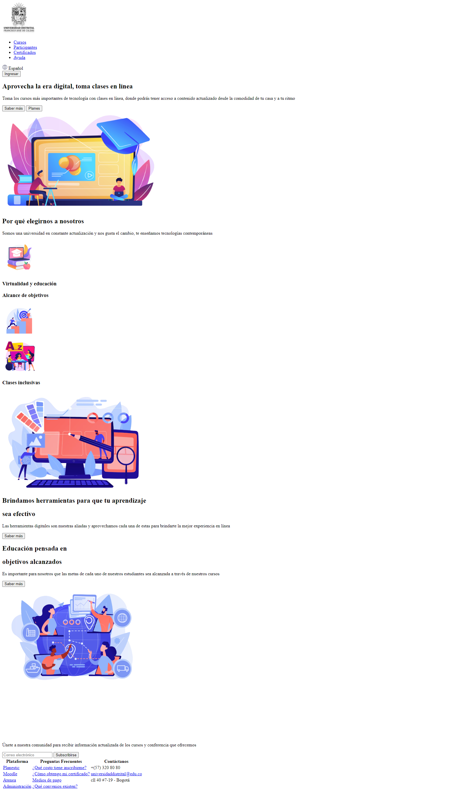
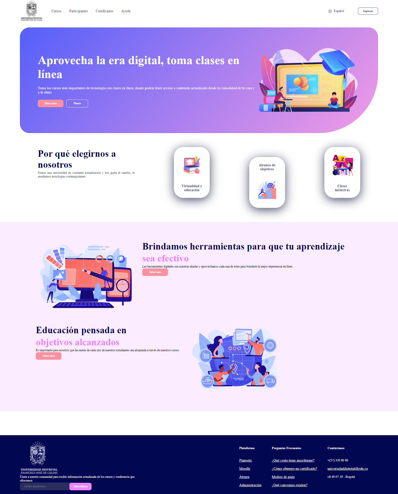
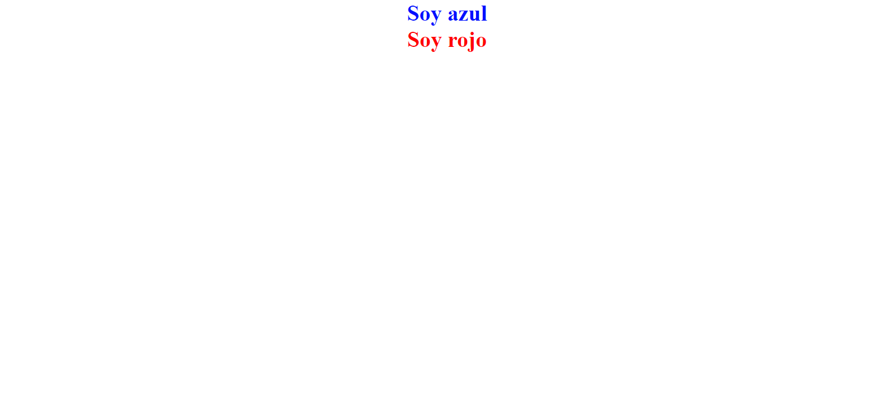
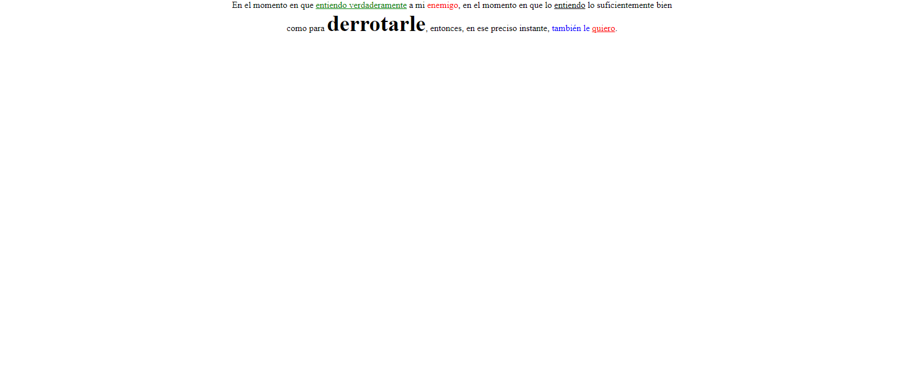
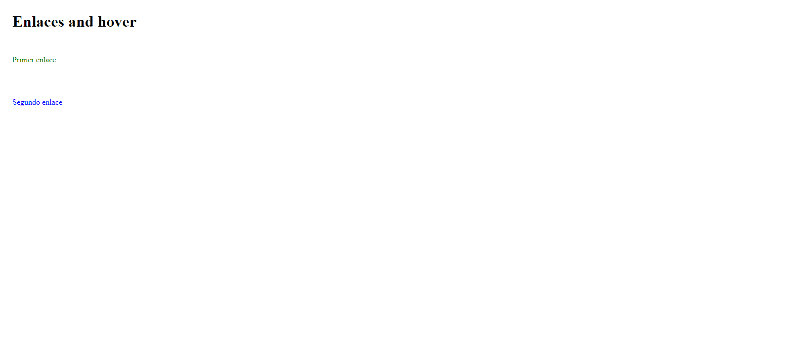
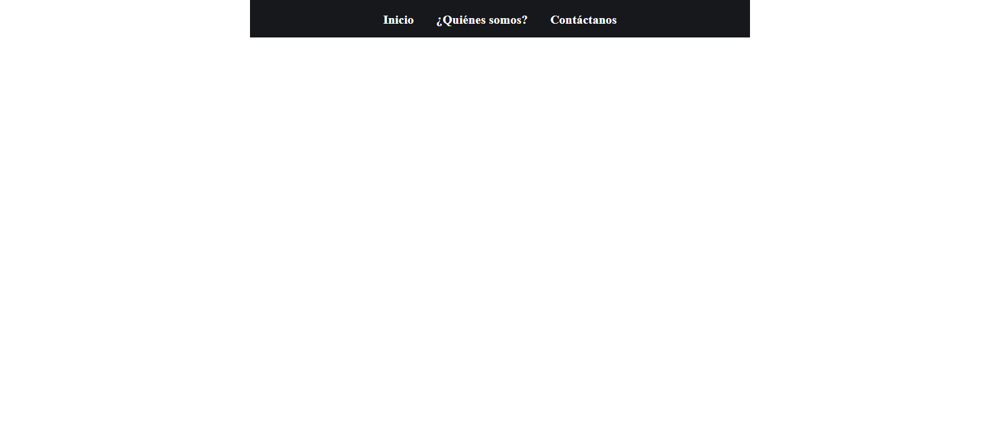
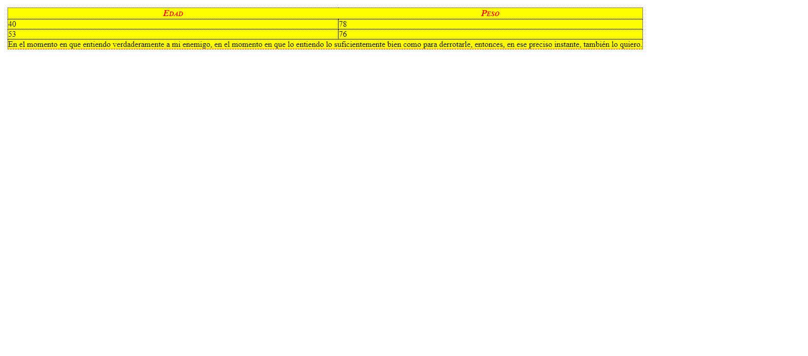

<h1>Taller 9: Lusbin Agudelo</h1>

<h2>Información</h2>

Curso: Full Stack Básico - Grupo 1

Profesor: Cristian Patiño

<h2>Punto 1: Link de figma</h2>
<a href="https://www.figma.com/file/dsD7udStE0tbt7uxMWgQFF/Lusbin-Agudelo---Figma-Exercise?type=design&node-id=0%3A1&mode=design&t=k9NsnamHHl4nXY27-1" target="_BLANK"> Link Figma </a>
<a href="https://agudelolusbin.github.io/taller-9-full-stack/" target="_BLANK">Link página</a>

<h2>Punto 2: HTML</h2>

<h2>Punto 3: CSS</h2>

<h2>Punto 4: HTML Y CSS</h2>

<h2>Punto 5: HTML Y CSS</h2>

<h2>Punto 6: HTML Y CSS</h2>

<h2>Punto 7y8: HTML Y CSS</h2>

<h2>Punto 9: HTML Y CSS</h2>
